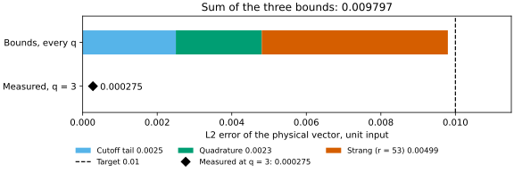

# LCHS

<a id="lchs-for-linear-dynamics"></a>LCHS (linear combination of Hamiltonian simulation) computes the solution at time $T$ of the linear ODE $du/dt=-Au+b$ for a constant matrix $A$, an initial vector $u(0)$ and an optional constant source $b$. It splits $A=L+iH$ into the Hermitian parts $L=(A+A^\dagger)/2$ and $H=(A-A^\dagger)/(2i)$ and, for positive semidefinite (PSD) $L$ and the default near-optimal kernel $g_\beta$, writes the propagator as a weighted integral of unitary evolutions,

```math
e^{-AT}=\int_{\mathbb R}g_\beta(k)\,e^{-iT(kL+H)}\,dk,
```

which NWQLib truncates to $|k|\le K$ and replaces by a finite quadrature sum (An, Childs and Lin, arXiv:2312.03916v2, Eqs. (3)–(4), (6)–(7) and Theorem 6, stated as [Result 25](../mathematics.md#r25)). A constant source adds the Duhamel term $\left(\int_0^Te^{-As}\,ds\right)b$ of their Eq. (2).

Use LCHS for the state of a linear dynamical system at a given time. For a steady state $Ax=b$, use [QLS](qls.md). For the default kernel–quadrature pair, `approximation_tolerance=0.01` limits two discretization error components, the cutoff tail and the k quadrature. It does not bound the total error of the output ([Selection and accuracy](#selection-and-accuracy)).

## Solve a linear ODE {#solve-a-linear-ode}

```python
from nwqlib import LinearDynamics, solve
from nwqlib.algorithms import LCHS

problem = LinearDynamics(A=[[.4, .15], [.05, .25]],
                         initial_state=[1, 0], time=.1)
result = solve(problem, method=LCHS())
print(result.solution)
```

```text
[ 0.96006038-1.54102084e-12j -0.00513885+3.61167323e-13j]
```

The matrix exponential gives $e^{-0.1A}(1,0)^T\approx(0.96082565,-0.00484022)$, so this default finite approximation has absolute L2 discrepancy about `.000821472` ([measured values](#measured-values)). Replace `A`, `initial_state` and `time` to solve your own system. The default output is the physical solution in the original coordinate order.

Each term $c_je^{-iT(k_jL+H)}$ of the finite sum is a branch. The quantum circuit applies the sum as a linear combination of unitaries (LCU) block (ACL Appendix A.3, Lemma 24, Eq. (178)), in which a SELECT operation applies the branch named by a binary address register. The number of address slots is the branch count rounded up to a power of two. The default plan of this example builds one nine-qubit dense SELECT with 204 branches and 256 address slots. NWQLib computes each branch matrix classically from its node's Hermitian eigensystem and inserts it as a controlled circuit, a finite construction for small systems. `execution="classical"` evaluates the planned finite sum on the host and reports classical outputs. Larger problems need a supported structured construction with its own limit check.

A constant source fits the default limits in classical execution:

```python
source_problem = LinearDynamics(A=[[.6, .1], [.1, .3]],
    initial_state=[1., 0.], time=.1, source=[.2, -.1])
source_result = solve(source_problem, method=LCHS(), execution="classical")
print(source_result.solution)
```

```text
[ 0.9601867 -3.83384053e-17j -0.01971285-2.65777763e-18j]
```

It evaluates a finite LCHS and Duhamel sum. The closed-form solution $e^{-AT}u_0+\left(\int_0^Te^{-As}\,ds\right)b$ is approximately $(0.96127277,-0.0195092)$, and the observed absolute L2 discrepancy is about `.00110499` ([measured values](#measured-values)). The default quantum plan of this problem instead needs 1836 branches, 2048 address slots and 12 qubits, more than `max_dense_select_slots=256`, so planning refuses it before any circuit is built.

The linear dynamics notebook (`examples/lchs_linear_dynamics_intro.ipynb`) applies LCHS to advection-diffusion. It separates product-formula error from quadrature error and compares kernels, quadratures, and exact and MPS state preparation by their errors, success probabilities and gate counts. The LCHS scientific notebook (`examples/lchs_scientific.ipynb`) applies a constant source and imaginary boundary penalty to four-coordinate heat flow. Running its cells performs one ten-qubit quantum solve, within the 12 qubits that the example notebooks simulate at most, and separates LCHS approximation error from finite-penalty error. Its canonical source is `examples/generators/lchs_scientific.py`.

## Supported problems and limits {#supported-problems-and-limits}

- $A$ and the source are time-independent. General time-dependent $A$ or source is not implemented ([open work](../ROADMAP.md#time-dependent-lchs)).
- With $A$ given as a [periodic stencil](#periodic-stencils), the problem must have no source.
- $L$ must be PSD. By default (`make_l_psd=True`) NWQLib shifts $L$ and restores the physical growth factor ([Inputs](#inputs)). With `make_l_psd=False`, a negative eigenvalue beyond the numerical window `psd_tolerance*||L||_2` is rejected.
- The default `dense_exact` SELECT is refused above `max_dense_select_slots=256` padded address slots. Planning never changes the grid, `duhamel_nodes` or the tolerance to fit, because fewer Duhamel or k nodes would change the approximation. Each dense branch is a controlled, classically computed matrix exponential, so the slot limit bounds construction cost and memory. The refusal names the time, tolerance, limit or backend choices that you can change.
- For dense $A$ with nonzero $L$, the spectral check accepts physical dimension at most 464 under the default `max_spectral_work=100_000_000`. A [periodic stencil](#periodic-stencils) has an analytically PSD $L$ with a known norm bound, so its compact construction does no dense spectral solve and this limit does not apply.
- `approximation_tolerance` and the reported kernel and quadrature bounds are component bounds. They do not bound the total physical-output error, which also depends on input scaling, PSD recovery, preparation, evolution and numerical errors.

The [technical roadmap](../ROADMAP.md#lchs) lists the current limitations of LCHS and the [planned scalable SELECT](../ROADMAP.md#scalable-lchs-select).

## What fits the default limits {#what-fits-the-default-limits}

| Case | System qubits | Branches (address slots) or dimension | Default limit | Outcome |
| --- | --- | --- | --- | --- |
| First example, default settings | 1 | 204 (256), nine qubits in total | `max_dense_select_slots=256` | fits |
| First example, `approximation_tolerance=.001` | 1 | 396 (512), ten qubits in total | `max_dense_select_slots=256` | refused |
| Constant-source example, quantum | 1 | 1836 (2048), 12 qubits in total | `max_dense_select_slots=256` | refused, classical fits |
| `dense_exact` SELECT on a signed-binary k grid, random dense $A$ with generic branches | 3, 4, 5, 6 | at most 128, 32, 8, 4 branches | `max_select_work=100_000_000` work units | 16 branches on 5 qubits (1.01e8 units) and 8 on 6 (2.16e8 units) are refused |
| Spectral check of dense $A$ with nonzero $L$ (none for a [periodic stencil](#periodic-stencils)) | 8, or 9 after padding | physical dimension at most 464 | `max_spectral_work=100_000_000` | a power-of-two input reaches 256 coordinates, dimensions 257 to 464 pad to 512 |
| Pauli decomposition of dense $L$ and $H$ for product formulas | at most 9 | 87,570,944 units at $d=512$, 385,888,256 at $d=1024$ | `max_select_work=100_000_000` | ten qubits are refused |

Work units are NWQLib's counts of planned classical operations, not timings. The SELECT figures depend on the system dimension, the node and branch counts and the address width, not on the norm of the branch generator, and they hold under the default `dense_control_route="auto"`. [Planning limits](#planning-limits) gives the work of each planning stage.

## Inputs {#inputs}

| `LinearDynamics` field | Meaning |
| --- | --- |
| `A` | Finite square matrix, or a supported structured generator such as a [periodic stencil](#periodic-stencils) |
| `initial_state` | Physical $u$ at `initial_time`, including magnitude and phase |
| `time` | Final time, at least `initial_time` |
| `source` | Optional constant physical source $b$. `None` means zero |
| `initial_time` | Initial time, default 0 |
| `time_unit` | Optional label. The numerical product of `A` and `time` must be dimensionless |

Known negative spectral endpoints of $L$ follow `make_l_psd`. The default shifts $L$ by $s$ and multiplies the result by the physical growth factor, $e^{-AT}=e^{sT}e^{-(A+sI)T}$ ([Result 25](../mathematics.md#r25)). `make_l_psd=False` rejects a violation beyond the numerical PSD window `psd_tolerance*||L||_2`, the scale of the eigensolver's rounding (LAPACK Users' Guide, 3rd ed., Sec. 4.7), so the decision does not depend on the time unit. No Method option bypasses a known false PSD assumption. The lower-level `cartesian_decomposition(..., eigcheck=False)` only decomposes $A$. It does not establish PSD or replace the Method's check.

For a dimension that is not a power of two, the encoded problem is $A\oplus0$, with zero-padded initial and source vectors. PSD shifting includes the dummy coordinates coherently. The original spectral endpoints and the analytic zero endpoint determine the padded problem, so no second eigensolve is needed. Results are projected back to the original coordinates. Constant sources keep their Duhamel times, weights, physical input norms and elapsed-time PSD compensation.

An exactly zero $L$ has known spectral endpoints `(0,0)`, so its eigensolve and the cubic-work limit check of that eigensolve are skipped. A near-zero nonzero $L$ follows the ordinary spectral and PSD rules. Small nonzero dissipation remains a quadrature problem, while exactly zero $L$ uses the unitary identity.

When `time` equals `initial_time`, there is no evolution. Known input vectors and norms are used directly. A requested quantum observable or sample still uses its state preparation and readout. An explicit classical vector observable is computed once on the host and recorded, and analysis and loading reuse its stored scalar. A zero state in compact form never reaches state preparation. Normalized outputs are then undefined, and a requested physical zero array is materialized once, within its limits, and recorded.

## Outputs {#outputs}

| Output | Value | Notes |
| --- | --- | --- |
| `Solution` (default), `StateVector(normalization="physical")` | $u(T)$ in the original coordinates | Keeps the physical phase and norm |
| `StateVector(normalization="unit")`, `NormSquared`, `QuadraticForm`, `NormalizedExpectation` | The state direction or a scalar of $u(T)$ | Each comes from its own readout. Normalized outputs are unavailable when the physical mass is zero |
| `Samples` | Measured original-coordinate indices and counts | Excludes dummy coordinates. Counts do not recover a complex vector |

With `shots=None`, a scalar observable is evaluated exactly from one simulation of the circuit, with no finite-shot error. Circuit, observable-action and normalization rounding remain separate error contributions. With finite `shots`, Pauli terms that commute qubit-wise share a measurement basis, and `shots` is the number of shots per group. Normalized outputs are unavailable at zero physical mass. [Readout](#readout) gives the details, and [readout tolerance branches](../error_evidence.md#readout-tolerance-branches) explains how the masses of an exact readout are checked.

`plan(...)` returns a `Plan`, the chosen construction and its costs, computed before any circuit exists. Its reconstruction fields `coefficient_l1_norm`, `physical_branches` and `padded_branches` describe its coefficient table. These fields differ between the classical and quantum `Plan` objects of a constant-source problem. The classical `Plan` of the example above evaluates the initial state and each of the eight Duhamel nodes with the same 204 kernel coefficients, and it reports their dimensionless one-norm 1.40368 and 204 branches. A quantum `Plan` prepares all 1836 branches in one SELECT, each kernel coefficient multiplied by the initial-state norm or by a Duhamel weight times the source norm, so its one-norm, 1.43507 once `max_dense_select_slots` accepts the `Plan`, is in the solution's unit.

Each discretization bound is reported in two forms:

| Name | Where | Meaning |
| --- | --- | --- |
| `kernel_approximation_bound`, `quadrature_bound` | Reconstruction fields of the `Plan` | Operator norm of the error for a unit input vector, before the PSD growth factor. The Result summary labels them "per unit input before PSD growth" |
| `kernel_approximation`, `k_quadrature` | Facts in `plan.facts`, and in `result.facts` for a classical Result | Physical L2 bounds. Each multiplies the field by the input norm, the Duhamel weight and `exp(psd_shift*t)` of each operator application and sums over the applications |

For `initial_state=[20, 0]` with the first matrix, the facts are twenty times the fields. The kernel term is the error of replacing the exact propagator by the finite kernel integral. For the ACL Eq. (7) kernel (arXiv:2312.03916v2) this is the cutoff tail. For the Low–Somma kernel it also includes the approximate-identity term, independent of the cutoff $R$, of [Theorem 1, Eq. (8)](https://arxiv.org/html/2508.19238v2), so increasing the cutoff alone does not remove that second contribution.

`plan(...)` keeps the nodes, coefficients, PSD conversion, input directions and numerical products it chose. It does not compute a solution or run a reference comparison. `estimate(plan)` adds up the resource formulas of the planned circuit without building it. Numerical errors whose bounds are unavailable remain unknown.

## Selection and accuracy

The default kernel is `near_optimal_eq7` with `beta=.75`, composite Gauss quadrature, `truncation_multiplier=1` and `approximation_tolerance=.01`. Beta lies in ACL's practical range in [Sec. 2.2](https://arxiv.org/html/2312.03916v2#S2.SS2). The construction gives half the tolerance to the cutoff tail and half to the k quadrature. It chooses $K$ by inverting the finite tail bound from ACL Eq. (186), independently of the panel width. An explicit multiplier of at least one can enlarge this cutoff.

The closed tail bound is $2e^{-x}/(\beta C_\beta x)$ with $x=\cos(\beta\pi/2)K^\beta$, from ACL Eq. (186) and $E_1(x)\le e^{-x}/x$ ([Proposition 26](../mathematics.md#r26) gives the derivation). For $K\ge1$, ACL Eq. (62) may tighten it.

For the default kernel–quadrature pair, Q-point Gauss panels are selected with the Bernstein-ellipse bound of [Trefethen, ATAP Theorem 19.3](https://www.chebfun.org/ATAP/chap19.m) (ISBN 978-1-61197-239-9), Eq. (19.8), whose index is $n=Q-1$. ACL's own panel prescription (arXiv:2312.03916v2, Lemma 11, Eqs. (64)–(65)) assumes $T\max\|L\|\ge32/e$. The first example has $T\|L\|=.045$, so that assumption fails there, while the ellipse bound holds for every $T\|L\|\ge0$. With strip margin $d=.1$, $b=.9$, $h=K/m$ and $\log\rho=\operatorname{asinh}(2b/h)$, the bound is

```math
\frac{64K\,e^{bT\|L\|}}{15C_\beta d(\rho^2-1)\rho^{2(Q-1)}}.
```

It holds for noncommuting $L$ and $H$ and has no dimension factor ([Proposition 27](../mathematics.md#r27)). The finite scalar search chooses the fewest nodes that satisfy this bound and builds only that grid. It stops when the minimum node count of every later panel count exceeds the best rule found. The stored `h1` is that grid's panel width. Rules other than Gauss have no panel width. Bounds are binary64 evaluations, not interval arithmetic. Positive underflow is rounded upward, never labeled exact zero.

For the first example, $K$ is about `27.51574`, the tail bound is `.005` and the quadrature bound is about `.00431140`. With this unit input and no PSD shift, the facts `kernel_approximation` and `k_quadrature` of the `Plan` equal these unit-input bounds. The observed absolute L2 discrepancy is about `.000821472`. Changing the tolerance to `.001` selects 396 branches, with tail and quadrature bounds about `.0005` and `.000450744`. Its classical finite sum has discrepancy about `.0000532605`. A dense quantum construction of that finer choice would need 512 address slots and ten qubits, more than the default 256-slot limit. The two component bounds do not bound the total physical-output error, which also depends on input scaling, PSD recovery, preparation, evolution and numerical errors.

The finite tail budget gives more nodes than the asymptotic cutoff recipe. Representative scalar selections at $T\|L\|$ equal to .045, 5, 10, 50 and 100 use 204, 276, 344, 900 and 1590 nodes, compared with 72, 100, 128, 348 and 622 under that recipe. These are node counts, not runtime ratios. Controlled evolution also depends on operator width, the evolution backend and the larger cutoff. The unchanged work, byte and SELECT-slot limits can refuse a construction that the recipe's smaller node count would have fitted.

The component bounds describe the finite sum in exact arithmetic. The norms of its terms add up to $\alpha$ times the input norm, where $\alpha$ is the coefficient one-norm, while the exact solution of the shifted problem is no larger than the input norm. A large $\alpha$ therefore means cancellation, and binary64 evaluation carries rounding of order $u\alpha$ times the input norm, with $u=2^{-53}$. Because LCHS reports floating-point error as unknown, planning refuses a coefficient table whose $u\alpha$ exceeds 0.1 times `approximation_tolerance`, the error budget of each construction stage. This affects Low–Somma with a large shift $c$, whose $\alpha$ is close to $e^c\operatorname{erfc}(1/(2\gamma))$, with $\gamma$ the kernel width that [Theorem 2](https://arxiv.org/html/2508.19238v2) selects, about 1.2e16 at $c=50$.

Error components fall into two classes. Discretization error (the kernel-integral error, k quadrature and, with a source, Duhamel quadrature) separates the exact propagator from the finite sum. Construction error (product-formula or QSP synthesis and approximate state preparation) separates that finite sum from the block the circuit applies. Each stage becomes a physical-vector bound by its own rule. The kernel-integral, k-quadrature and product-formula stages are weighted per application by the input norm, the Duhamel weight and `exp(shift*elapsed)`. QSP synthesis and coefficient preparation are scaled by the recovery scale of the prepared coefficient state. The Duhamel and input-preparation stages are already physical bounds. The available stages are summed once and then converted to the requested output, and each component is reported with its own value or the reason it is unavailable.

Planning fixes the inputs of the kernel-integral, k-quadrature and budgeted product-formula bounds, so `plan(...).facts` already holds their values. A classical `Plan` lists these stages, and its Result records the same values as sums over the executed applications. A quantum `Plan` also lists the preparation stages and, for QSP, the QSP synthesis stage. For a dense $A$, the synthesis stage of fixed-step `trotter` and the Duhamel stage of a nonzero constant source stay unknown on both execution routes until `LCHSRefinement` evaluates them. The one exception is quantum `qsp_block_encoding` with $A=0$, whose constant Duhamel integrand gives an exactly zero Duhamel stage.

The ordinary `compare` entry plans several configured LCHS Methods for one Problem and estimates their resources before execution. Kernels compared on identical signed-binary nodes isolate the kernel change. Low–Somma selects its own symmetric trapezoidal grid from its tolerance, so a comparison that includes it changes the kernel–quadrature pair. Comparisons at fixed construction settings do not measure cost at matched accuracy. The [MPS analysis](#coefficient-mps-analysis) studies compression and circuit fitting for one kernel–quadrature pair.

### Error budget for heat flow on a ring {#error-budget}

For heat flow on a ring, `plan(...).facts` gives every error bound before anything runs, and only the cutoff tail, the k quadrature and the Strang product have nonzero bounds. The problem is $du/dt=-Lu$ with $L=\tfrac14(2I-S-S^\dagger)$ on $2^q$ sites, where $S$ shifts the site index by one, from a unit point source at site 0 until $T=1$, with $L$ given as a [periodic stencil](#periodic-stencils). `approximation_tolerance=0.005` is split equally between the cutoff tail and the k quadrature, and `trotter_synthesis_tolerance=0.005` sets the Strang step count. With the default kernel–quadrature pair, the three bounds together bound the ideal L2 error of the physical vector by 0.01 for this unit input, before rounding in the circuit and sampling.

```python
import numpy as np
from scipy.linalg import expm
from nwqlib import LinearDynamics, plan, solve
from nwqlib.algorithms import LCHS
from nwqlib.operators import PeriodicStencil
from nwqlib.problems import ingest_occupation

q = 3  # a ring of 2**q sites, small enough to simulate
heat = LinearDynamics(A=PeriodicStencil(q, mass=0.0, diffusion=0.25),
                      initial_state=ingest_occupation("0" * q, num_qubits=q),
                      time=1.0)
method = LCHS(hamiltonian_evolution_backend="trotter",
              approximation_tolerance=0.005, trotter_steps=None,
              trotter_synthesis_tolerance=0.005)
selected = plan(heat, method=method, seed=7)
for item in selected.facts:
    print(item.fact.quantity, item.fact.value.value)

result = solve(selected)
S = np.roll(np.eye(2**q), 1, axis=0)  # S e_j = e_(j+1 mod 2**q)
exact = expm(-(2 * np.eye(2**q) - S - S.T) / 4)[:, 0]  # exp(-LT) e_0, T = 1
print(np.linalg.norm(result.solution - exact))
```

```text
kernel_approximation 0.002499999999999994
k_quadrature 0.002304654032281964
trotter_synthesis 0.004992709890319826
lcu_coefficient_preparation 0.0
initial_state_preparation 0.0
0.00027535384494835184
```

The coefficient and initial-state preparation bounds are zero because both preparations are direct. The last line is the L2 distance between the quantum solution and the matrix exponential. `solve` ran the 12-qubit circuit on the default local Aer statevector, and the output above was printed with Python 3.12.14, NumPy 2.5.2, SciPy 1.18.1, Qiskit 2.5.2 and Aer 0.17.2 on an Apple M3 Max (macOS arm64).

| Quantity | Value | How it is obtained |
| --- | --- | --- |
| Kernel | ACL Eq. (7) kernel `near_optimal_eq7`, $\beta=0.75$ | Default |
| Cutoff $K$ | 32.1994 | Inverts the tail bound of ACL Eq. (186) at the tail's share, 0.0025 |
| Gauss rule | 18 panels of 15 points | Fewest nodes whose quadrature bound meets the quadrature's share, 0.0025 |
| Branches (address slots) | 270 (512) | One branch per node. Address slots are the branch count rounded up to a power of two |
| Coefficient 1-norm | 1.40522 | Sum of the branch-weight magnitudes, not a success probability |
| Cutoff tail bound, `kernel_approximation` | 0.0025 | Closed-form bound from ACL Eq. (186), evaluated in binary64 |
| Quadrature bound, `k_quadrature` | 0.00230465 | Bernstein-ellipse bound of Trefethen, ATAP Theorem 19.3, evaluated in binary64 |
| Strang coefficient $B$ | 14.0245 | $r^2$ times the recorded bound at $r$ |
| Strang steps $r$ | 53 | Smallest $r$ with $B/r^2\le0.005$ |
| Strang bound, `trotter_synthesis`, at $r-1=52$ and at $r$ | 0.005187 and 0.004993 | $B/r^2$ in exact rational arithmetic, recorded rounded upward. 52 steps would exceed 0.005 |
| Coefficient and initial-state preparation bounds | 0 and 0 | Direct preparation |
| Sum of the bounds | 0.00979736 | Ideal L2 error bound of the physical vector for this unit input, against the target 0.01 |
| Measured L2 error at $q=3$ | 0.000275354 | Quantum solve above, against `scipy.linalg.expm`. It also contains the rounding in the simulated circuit, which the bounds exclude |



The diamond marks the measured error of the solve above. `docs/scripts/error_budget_figures.py` draws the figure from this example.

The branches, step count and bounds depend on $T\lVert L\rVert=1$ and the diffusion coefficient, not on the ring size. Planning and resource estimation, which build no circuit, extend the example to rings of up to $2^{100}$ sites:

| System qubits $q$ | Total qubits | Branches (address slots) | Strang steps $r$ | Sum of the bounds | CX upper bound per attempt |
| --- | --- | --- | --- | --- | --- |
| 3 | 12 | 270 (512) | 53 | 0.00979736 | 84,846 |
| 10 | 19 | 270 (512) | 53 | 0.00979736 | 105,198 |
| 20 | 29 | 270 (512) | 53 | 0.00979736 | 169,858 |
| 40 | 49 | 270 (512) | 53 | 0.00979736 | 426,378 |
| 100 | 109 | 270 (512) | 53 | 0.00979736 | 2,213,538 |

Each row plans the problem above at that q and counts its CX gates with `estimate(selected, context=ResourceContext(basis="cx"))` ([Resource inspection](#resource-inspection)). The CX upper bound counts the CX gates of one coherent attempt before gate cancellation or routing, with no repeat-until-success factor.

`estimate` reports the T count of these plans as unavailable in the default, `cx` and `clifford_t` bases, because the coefficient preparation, its inverse and the periodic phase and step blocks have no T-count rule ([Choose the gate basis](../resources.md#selected-laws-and-logical-bases)). [Estimate fault-tolerant resources](../fault-tolerant-resources.md) gives T counts of small compiled circuits.

### Measured values {#measured-values}

| Value | Quantity | Problem and settings | Environment |
| --- | --- | --- | --- |
| `.000821472` | Absolute L2 discrepancy against `expm` | First example, default `LCHS()`, quantum execution on the default local Aer statevector | Python 3.12.14, NumPy 2.5.2, SciPy 1.18.1, Qiskit 2.5.2, Aer 0.17.2, macOS arm64 |
| `.0000532605` | Absolute L2 discrepancy against `expm` | First example, `LCHS(approximation_tolerance=.001)`, `execution="classical"` | Same |
| `.00110499` | Absolute L2 discrepancy against `closed_form` | Constant-source example, default `LCHS()`, `execution="classical"` | Same |
| up to 4.2e-5 | Entry error of Qiskit's two-qubit synthesis of a unitary near the identity | 60 random generators ([dependency issues](../dependency_issues.md#two-qubit-synthesis-replaces-weyl-coordinates)) | Qiskit 2.5.2 |

## Evolution backends {#native-methods-and-physical-coordinates}

Select the branch evolution with `LCHS(hamiltonian_evolution_backend=...)`:

| Backend | Branch evolution | Step count |
| --- | --- | --- |
| `dense_exact` (default) | Controlled dense branch matrix from the node's Hermitian eigensystem | None, no product formula. Accepts only `trotter_order=2` |
| `trotter` | Fixed-step sorted-Pauli Lie-1 or Suzuki-2 product formula | `trotter_steps`, or on the [periodic route](#periodic-stencils) `trotter_synthesis_tolerance` |
| `trotter_error_budgeted` | Product formula with the smallest step count per node that fits an error budget | Chosen per node. Requires `trotter_steps=1` |
| `qsp_block_encoding` | QSP evolution of a joint generator built from L and H block encodings | None, no product formula. Accepts only `trotter_order=2` |

`trotter_order` selects the Lie-1 or Suzuki-2 formula of either product-formula backend. `psd_tolerance` is the numerical PSD window. Kernel and k-grid choices use `lchs_kernel` and `k_quadrature`. The [LCHS API](../api/algorithms/lchs.md) explains the MPS state-preparation controls and the work and byte limits. Those limits do not bound the total physical error.

`dense_exact` and `qsp_block_encoding` do not use `trotter_steps`. The Method sets that field to one before computing its content hash, so Methods that differ only in an ignored step count are the same Method. A nondefault `trotter_steps` is ignored with a `UserWarning` at planning. [Saved run mechanics](../development/execution.md#saved-run-mechanics) describes what happens to the ignored value when the Method is copied or loaded.

When you change the backend of an existing Method to `"trotter"`, set `trotter_steps` in the same change. Changing only the backend uses the canonical one step. `trotter_error_budgeted` chooses per-node counts from its separate error budget, based on `approximation_tolerance`.

- `dense_exact` computes each small branch matrix from its node's Hermitian eigensystem and controls the corresponding circuit on the address bits. `dense_control_route` selects how the address bits control a branch on two or more system qubits. The default `"auto"` synthesizes the whole controlled branch for one address bit and controls each synthesized gate for more ([dense control route](../development/dense_synthesis.md#dense-control-route)). On the gate-wise route, before adding the address controls, NWQLib replaces the dense branch unitary by a circuit of CX and one-qubit gates that equals it to rounding (`subroutines/_dense_synthesis.py`). Generic control would otherwise use Qiskit 2.5.2's own synthesis, which replaces a two-qubit unitary close to the identity by a local gate. A branch $e^{-it(kL+H)}$ is close to the identity when $t(kL+H)$ is small, for example after a short elapsed time, and for such a branch that replacement gave entry errors measured up to 4.2e-5 ([measured values](#measured-values)). [Controlled dense unitaries](../development/dense_synthesis.md#controlled-dense-unitaries) describes the construction, and [Planning limits](#dense-select-construction) its cost.
- `trotter` uses fixed-step sorted-Pauli Lie-1 or Suzuki-2 evolution. Its order and per-node repetitions are saved.
- `trotter_error_budgeted` gives each node the smallest step count $r$ for which $r$ one-step bounds at step length $t/r$, plus the published pruning bound $tm$ for an upper bound $m$ on the pruned Pauli mass, fit the per-node error budget of 0.1 times `approximation_tolerance`, with $t$ the node's elapsed time (CSTWZ doi:10.1103/PhysRevX.11.011020, Sec. V B). It does not read `trotter_steps`, so a Method that pairs it with a value other than the default 1 is refused. The one-step bound is CSTWZ Proposition 9, Eq. (120), for `trotter_order=1` and Proposition 10, Eq. (121), for order 2, with each commutator norm replaced by its triangle-inequality sum over Pauli terms. Each one-step bound is a constant times the square (order 1) or cube (order 2) of the step length, so order-1 step counts grow as the inverse of the per-node error budget and order-2 counts as its inverse square root. The budget bounds only the product-formula synthesis error of each node.
- `qsp_block_encoding` chooses the L and H block encodings, joint-generator diagonal weights, polynomial and phases once. Execution and loading a saved result reuse them. Its synthesis ancillas join the success projector. An exactly zero joint generator has identity evolution with no invented zero scale or phase fit.

`lcu_select_implementation="auto"` uses only the SELECT implementations that apply to the problem, with their cost rules. Explicit `structured`, `multiplexor` and `branch_controlled` choices keep their own domains. `structured` requires proof of an eligible affine structure, computed from the k-node addresses and the generator's real Pauli coefficients.

### Periodic stencils {#periodic-stencils}

For $A$ given as a `PeriodicStencil`, planning keeps the compact input. This route has a homogeneous Strang construction only, so a problem with a source is refused (`periodic.plan_periodic`). The Strang path keeps the one-qubit double-wrap edge convention. Its synthesis bound for $r$ symmetric Strang steps is $B/r^2$ per unit input, with $B=T^3\sum_j|c_j|(2|k_j|\,\mathrm{diffusion}+|\mathrm{potential}|)^3/3$ over the nodes $k_j$ and coefficients $c_j$ (`periodic.select_periodic_parameters`). `trotter_steps` fixes $r$. `LCHS(hamiltonian_evolution_backend="trotter", trotter_steps=None, trotter_synthesis_tolerance=eps)` instead selects the smallest $r$ with $B/r^2\le$ `eps` once the grid and $B$ are known, then applies `max_trotter_steps` and the construction limits `max_bytes` and `max_select_work`. A Method that sets both fields, or neither, is refused, and other operators refuse the tolerance because their fixed-step routes have no planning bound to invert.

For heat flow on a ring, `PeriodicStencil(q, mass=0.0, diffusion=0.25)` with $T=1$, `approximation_tolerance=0.005` and `trotter_synthesis_tolerance=0.005` give $B=14.02$ and $r=53$ at every $q$, with $B/53^2=0.00499$ and $B/52^2=0.00519$. The tolerance uses the frame of `approximation_tolerance`. With the default kernel–quadrature pair, whose tail and quadrature bounds fit `approximation_tolerance`, the two tolerances together bound the ideal vector error of a unit input, before rounding in the circuit and sampling. Because the bound is sufficient and not tight, a smaller $r$ may also keep the synthesis error within the tolerance. [Error budget for heat flow on a ring](#error-budget) shows the three bounds of this example against the 0.01 target.

A periodic construction refusal reports the work and byte limits it exceeds. If a smaller positive step count can satisfy both limits, the message computes the largest such count `r_star` below the refused count. In automatic mode it offers a synthesis tolerance, rounded upward, that selects at most `r_star` steps, provided that tolerance is finite. This clears both construction limits, but a later planning check can still refuse. In fixed-step mode the remedy is a positive integer `trotter_steps<=r_star`. Reducing the step count increases or preserves the Strang bound, so it trades the construction budget against the error bound. If even one step cannot fit, only a change to the construction or its limits can resolve that refusal. The earlier automatic step-limit refusal addresses `max_trotter_steps` separately.

## Explicit checks and saved results

```python
from nwqlib.algorithms.lchs import LCHSVerification
from nwqlib.evidence import Certificate

checks = LCHSVerification(reference="expm", metric="absolute_l2", threshold=.01)
receipt, facts = result.verify(checks=checks)  # The only reference computation.
print(facts[0].fact.value.value)  # This comparison emits a Float64 discrepancy.
certificate = Certificate(plan_id=result.plan_id, result_id=result.content_id,
    assessment=result.assess(absolute_tolerance=.01), checks=())
certificate = certificate.with_verification(
    result, options=checks, evidence=facts)
print(certificate.checks[0].status)  # PASS: .000821... is below .01.
result.save("lchs-result")
```

```text
0.0008214720329548587
PASS
```

Checks are explicit extra computations. Choose the reference with `reference`:

| `reference` | Compares the result with | Applies to |
| --- | --- | --- |
| `expm` | $e^{-AT}u_0$ | Problems without a source |
| `ivp` | An RK45 solve of $du/dt=-Au+b$, with explicit `rtol`, `atol` and `max_rhs_calls` | Problems with a constant source |
| `closed_form` | $e^{-AT}u_0+\left(\int_0^Te^{-As}\,ds\right)b$, both terms of ACL arXiv:2312.03916v2, Eq. (2) | Problems with a constant source |
| `ivp_closed_form` | Both of the above, with their signed consistency | Problems with a constant source |
| `selected_grid` | The exact saved finite sum, including the saved product-formula steps, so its discrepancy excludes the kernel-integral, k- and Duhamel-quadrature and product-formula errors | Problems with or without a source |

Every reference needs a dense physical `A` and never densifies one implicitly. `closed_form` evaluates one exponential of the augmented matrix `[[-A*T, b*T], [0, 0]]`, whose top-right block is the Duhamel term. It equals $A^{-1}(I-e^{-AT})b$ for invertible $A$, is defined for singular $A$ as well and avoids the cancellation of forming $I-e^{-AT}$ when $\|A\|T$ is small. The `expm` and `closed_form` references use `scipy.linalg.expm`, or `scipy.sparse.linalg.expm` for a triangular matrix, because SciPy's dense kernel loses accuracy on triangular input with close diagonal entries ([dependency issues](../dependency_issues.md#triangular-matrix-exponential)). A reference whose matrix has a one-norm above `2**37`, or whose exponential is not finite in binary64, is reported as unknown. The quantum `selected_grid` reference evolves the application vector through the decomposed branch circuit. `LCHSRefinement` requests component-bound analysis with its own explicit limits. Its verification record contains all observations, while the second returned tuple contains only output-error facts suitable for assessment, so a spectral-norm-only request leaves that tuple empty. Reference discrepancies are empirical numerical evidence, not a complete proven error bound. [Reference work](#reference-work) gives the work each reference counts.

`result.verify` returns the verification record `receipt` and the error facts `facts`. The check assessment above applies its threshold to the same facts and Result, without calling `verify` again. These facts answer only `checks`. Another threshold, metric or reference needs `result.verify(checks=...)` with the new options, which computes the reference again ([Check accuracy and verify a result](../verification.md#facts-belong-to-the-options-that-produced-them)). The aggregate accuracy assessment can independently remain INCONCLUSIVE. See [Check against a tolerance](../verification.md#check-against-a-tolerance).

`load_result(...)` restores the original Method, `Plan`, computed output, saved phases, MPS cores and numerical data. The saved plan names a separate JSON file with NPY arrays for the data that grows with the grid and schedule: node and coefficient tables, host actions and SELECT angle tables. Loading binds each block's data as planning did. SELECT takes that data and the Problem's elapsed time, the periodic leaves take the periodic Strang data, the input preparation is the Problem's initial state, and a state-preparation block takes its saved tensor. Loading recomputes the content hash `selected_identity` of `LCHSData` and compares it with the SELECT block or host kernel, and it recomputes the `preparation_identity` of each saved state-preparation block. The periodic Strang data are used as saved. Loading does not fit phases, solve an eigensystem, recompute a reference or reselect a grid.

## Coefficient MPS analysis

```python
from nwqlib.algorithms.lchs import resolve_lchs_coefficient_plan

coefficients = resolve_lchs_coefficient_plan(problem)
decomposition = coefficients.decompose_mps(max_bond_dim=4)
```

The coefficient state-preparation target is the ordered normalized magnitude tensor `sqrt(abs(c) / sum(abs(c)))`. Complex coefficient phases stay in SELECT. A `Plan` exposes its coefficient table, and overrides require a new `Plan`. Positive scaling permits reuse of identical normalized tensor data, while reordering or changing the tensor rejects stale cores. TT compression error and layered MPS circuit fidelity are different quantities. Another kernel–quadrature pair has its own coefficient tensor and needs its own decomposition. Constant-source quantum construction supports direct state preparation only. MPS state preparation there would need its own decomposition of the source-branch coefficient tensor and of both input directions.

Finite-layer MPS state preparation may change the LCU block even when the TT-SVD discarded weight is zero. Its circuit error remains unevaluated until an explicit validation of that circuit, and the report states this scope.

The report reads the stored MPS layer count, maximum stored bond, core bytes and construction work. Circuit fidelity validation still performs an explicit statevector simulation, and explicit MPS reference analysis may reconstruct the tensor. Reporting calls neither. `max_svd_work` bounds the prospective TT-SVD and the layered circuit construction, whose work formula `mps.layered_construction_size` follows the scikit_tt sweeps that `mps_circuit.mps_to_circuit` repeats after every extracted gate. The direct MPS builder checks both before it starts. LCHS planning checks the layered construction of each `mps_circuit` state preparation against the Method's `max_svd_work` and `max_bytes`, the limits that building the circuit applies again. The workspace of the dependency remains unknown.

## Resource inspection

`estimate(plan)` adds up the resource formulas of the plan. For a separate count on representative built circuits:

```python
from nwqlib.algorithms.lchs.quantum_resources import sample_resources

samples = sample_resources(result.plan, max_qubits=13)
```

`samples["representatives"]` lists each representative circuit with its name, its multiplicity in the construction and its operation counts. `samples["weighted_totals"]` gives, for each readout setting (a sampled group, a mass setting or the exact reduction), the operation counts of every core representative multiplied by its multiplicity, plus the counts of that setting's readout representative. A representative's operation names stand for every block it represents, so a weighted count under a node-specific name can cover several nodes. Weighted totals are estimates. They do not model angle-specific cancellation, cross-block optimization or SDK workspace, and they do not combine depths.

A dense exact SELECT builds no representative. Its `samples["structural_bounds"]` record uses the value-independent upper counts of the library synthesis and control route for every branch. Each record names its basis, route and assumptions, and has `count_kind="structural_upper_bound"`. It is not a count of an observed circuit, and the weighted totals do not include it. Counts for an arbitrary explicitly requested compilation require inspection of that circuit. Source and compact periodic workloads use explicit full inspection of `prepare(plan).inspect_resources(index=...)`. Shared `inspect_circuit_resources` does no simulation and transpiles only when requested. No resource calculation establishes solution accuracy.

The compiled SELECT of `qsp_block_encoding` is one QSP Hamiltonian evolution of the joint generator built by `build_control_diagonal_generator_encoding`. It makes `3*(cos_degree + sin_degree)` queries to the joint block encoding (the 3-step OAA over both parity ladders), and each query costs one call per child encoding plus one multiplexed RY of `2**control_qubits` rotation angles per child. These counts are structural, rotation angles and child calls before gate synthesis, so they do not depend on the Qiskit version. In Pocrnic et al., arXiv:2506.20760v2, Lemma 7, p. 15, each effective-Hamiltonian query uses one `U_A` plus one `U_A^dagger` call and `2M` multi-controlled rotations, where `M` is the number of quadrature nodes. Here each query uses `child_count` child calls and `child_count * P` multiplexed rotation angles. `child_count` is 2 for the $L$ and $H$ branches and 1 when $H=0$, and `P = 2**control_qubits` is the number of address slots after power-of-two padding, so `P >= M`. The comparison `2P >= 2M` with the paper therefore holds for two children. The paper's GQSP and qubitization query count and amplification constants are not part of this count.

Import the inspection function with `from nwqlib.backends.inspection import inspect_circuit_resources`. `estimate` can instead count CX gates with `ResourceContext(basis="cx")`, as shown in [resources](../resources.md), without preparing a circuit.

## Planning limits and numerical scope {#planning-limits}

The Method's work and byte limits have the defaults `max_select_work=100_000_000`, `max_spectral_work=100_000_000`, `max_quadrature_work=100_000_000`, `max_svd_work=100_000_000`, `max_readout_work=2_000_000_000` and `max_bytes=10_000_000_000`. Work units count planned classical operations, not timings.

`max_admission_steps` (default 1,000,000) limits the work of checking each planned circuit description and does not change the quantum operations. If planning refuses with this field, raise it at least to the reported count. A refused count of stored entries is complete, while a refused count of checking work is a lower bound that may need raising further, and later preparation can need more in either case ([planning work limit](../development/program_checks.md#planning-work-limit)).

### Quadrature selection {#quadrature-selection}

The composite-Gauss provider first completes its scalar panel search. It then checks `max_quadrature_work` against the search work, 32 units per selected node and the cubic Gauss-rule construction work, before allocating the node arrays. A refusal names the complete work of that rule. The limit therefore covers the search plus the construction of the chosen rule, not every scalar probe.

### Dense SELECT construction {#dense-select-construction}

The CX formula of the `dense_exact` backend, `dense_branch_select_cx` in `native.py`, bounds on the gate-wise route the gate count of the exact synthesis and prices each gate at Qiskit's count with the address controls added. On the whole-matrix route it is the CX bound of the whole-matrix synthesis on the system qubits and the address bits. Planning counts the classical work and bytes of each node eigensystem and branch matrix (`time_independent_terms._spectral_branch_requirements`, registered in [Engineering constants](../ENGINEERING_CONSTANTS.md#numerical-choices-and-representation-sizes)), of each branch synthesis and of Qiskit's control of the synthesized gates with the address bits against `max_select_work` and `max_bytes` ([exact synthesis check](../development/dense_synthesis.md#admission-of-the-exact-synthesis)). This work depends on the system dimension, the node and branch counts and the address width, not on the norm of the branch generator. [What fits the default limits](#what-fits-the-default-limits) gives the resulting branch counts for generic dense branches. A dense-dilation child of `qsp_block_encoding` is counted the same way, and `dense_control_route` also selects how the joint generator's combine qubit controls it. With one address bit the whole-matrix route counts the whole-matrix synthesis on the system qubits plus one instead.

The `dense_exact` route computes one Hermitian eigensystem for each distinct $kL+H$ and reuses it for every elapsed time, including the source nodes. Host evaluation applies the eigenphases to vectors without forming each dense propagator. A quantum SELECT forms one elapsed-time branch matrix at a time and synthesizes it within its work and byte limits. Its storage count includes the live factors, matrix-formation workspace, synthesis and control workspace and completed branch circuits. Host vector actions and explicit branch matrices have different operation counts, and the resource record counts the operations each performs. PSD recovery uses each application's elapsed time. "Dense exact" names the ideal matrix function. Its binary64 evaluation and circuit synthesis carry eigensolver, phase-evaluation, contraction and synthesis errors, which are separate from the real-arithmetic LCHS approximation budget.

### Product-formula planning {#product-formula-planning}

Dense product-formula planning decomposes $L$ and $H$ once with the recursive Pauli block transform. Its work and output conversion grow as $qd^2$ for $d=2^q$. Under the string-table work formula and the default `max_select_work=100_000_000`, the decomposition sets aside 87,570,944 units at $d=512$ and 385,888,256 at $d=1024$, so the decomposition stage accepts at most nine system qubits. At nine qubits, decomposition plus the conservative second-order relaxed SELECT coefficient-selection formula accepts 236 nonidentity union labels for 200 distinct nodes and 256 address slots, or 235 labels for 4096 address slots. These figures assume no identity coefficient, $p$ entries in each L/H support and the full pair upper bound. They include support alignment and the work set aside for the dropped mass. Angle-table work, the byte check and circuit construction remain separate limits on a complete `Plan`.

Product-formula selection shares the ordered Pauli-label structure across k-nodes and evaluates each node's bound coefficient once. Initial and source applications reuse that coefficient at their own elapsed times, pruning bounds and step counts. The full Pauli-triangle count is used when its remaining work and storage fit. Otherwise selection uses the second-order suffix relaxation and records `bound_variant="relaxed_prefix"`, or stops before the refused stage. The remaining work always includes node-specific magnitude evaluation and the route's other work. The bound computation checks its pair and triple structures against the limits before construction. A shared ordered support pays the mask tests once, while every distinct active node pays its own magnitude contraction. The byte check includes combined-node records and other allocations that stay live during that phase. Padding slots do not create additional node counts.

For order two, consider 200 distinct active k-nodes, nine active applications and one shared sorted union of $p$ nonidentity labels, with no identity coefficient. Use $p$ entries in each L/H dictionary, $p$ kept terms at every node and the full pair and triple upper bounds. The preparation and counting work formulas, including support alignment and the work set aside for the dropped mass, reach the following largest $p$ under `100000000` units of planning work. The fixed-step bound computation reads each distinct node's stored coefficients with one visit per kept label and coefficient pair and two scalar visits for the identity coefficient and upper dropped mass. Its work also includes the preparation work of each stage that uses the count, the shared count itself and the application arithmetic.

| System qubits | Stage | Largest $p$, full / relaxed |
| --- | --- | --- |
| 20 | Proven fixed-step bounds | 111 / 557 |
| 20 | Host stage | 114 / 693 |
| 20 | SELECT coefficient selection (4096 address slots) | 113 / 687 |
| 9 | Proven fixed-step bounds | 112 / 630 |
| 9 | Host stage | 114 / 693 |
| 9 | SELECT coefficient selection (4096 address slots) | 114 / 693 |

These are work-only stage upper limits, before decomposition, host actions, SELECT angle tables and circuit construction. The full limit check also includes the live data and the storage of the count, so these figures do not imply that a complete dense `Plan` fits. In particular, the current dense arrays at 20 qubits exceed the default byte limit. A homogeneous 200-node SELECT uses 256 address slots, while the field-padded layout with an initial state and eight source applications uses 4096. Padding adds slot records and angle storage but no new k-node count. The counting work and byte formulas are `census_work` and `census_bytes` in `subroutines/trotterization/error_budget.py`, and `_lchs_census_choice` in `time_independent_terms.py` applies them to the shared structure and distinct node contractions, adding 9 bytes per row of the larger of the pair and reserved triple counts for one node's row selection ([Engineering constants](../ENGINEERING_CONSTANTS.md#other-numerical-guards)). Each caller adds its own preparation and application work.

The dropped coefficient mass is an upper bound for the terms omitted. Its product with the evolution time is reported, rounded upward, as the pruning bound. The product formula is selected against the requested error budget minus that pruning bound, rounded downward. Its formula bound and the combined pruning-plus-formula bound are reported rounded upward. These directions ensure that the exact sum of the reported contributions and the reported total do not exceed the requested error budget. Selection can require additional steps or fail when no positive representable formula error budget remains.

### Classical product-formula evaluation {#classical-product-formula-evaluation}

For a classical Pauli product formula, planning stores the coefficient table once per k node and the elapsed time, step count and route per application. Rotations are computed at application time as coefficient times elapsed time divided by steps, in that order. The limit check follows the maximum of decomposition, node-table construction and action phases, while every stored table still live stays counted. Vector actions use `cos(a)*v - i*sin(a)*P@v`. A large repetition count can instead select one dense step and binary powering. With dimension $D$, $r$ effective repetitions and $R$ rotations per step, the routing work estimates are `r*R*(W_action + 2*D)`, where `W_action` is the single-label Pauli action formula of `operators._pauli.pauli_action_requirements`, and `R*D**2 + (floor(log2(r))+popcount(r)-1)*D**3 + D**2`. The vector update adds one D-entry scaling and one D-entry scaled addition per rotation, with scalar trigonometric preparation included in those kernel and pass units. Effective repetitions are `max(1, steps)` for the saved step count. Only routes whose known arrays and work fit the Method limits are eligible, and equal work selects vectors. These are operation-size estimates, not timing predictions.

The node table, per-node steps, routes and route work are stored in `LCHSData.host_actions` of the `Plan`. Construction work and aggregate action work are in `plan.reconstruction.classical_work`. `result.applications` holds one record per operator application with its schedule and component error facts. The host kernel declares the records' JSON size bound, so the run sets aside their bytes with the outputs. Reading a report or a saved result does not reselect or execute an action. Constant-source nodes use their own elapsed time and PSD recovery. The `dense_exact` backend instead forms one Hermitian eigensystem per node and uses it for every operator application, the nonzero initial state and each constant-source node, each at its own elapsed time.

### Readout {#readout}

An exact scalar readout (`shots=None`) fixes the method's success and physical-condition bits and excludes dummy coordinates. A Pauli observable with $L$ terms then needs $O(LN)$ classical work on the $N$-coordinate encoded system. The normalized expectation divides the projected quadratic moment by the physical-slice mass. A physical quadratic form also applies the method's recovery scale.

Exact readout reduces the saved state to scaled scalar statistics. The reduction scans the complete norm and success mass of the simulated state in bounded tiles, shares the physical mass when the two sets of outcomes coincide, and evaluates the observable on the success-and-physical slice. The limit check includes the saved state, the observable's serialized, parsed and packed representations, and the workspace for gathering, scaling and grouped action. Scaled statistics carry the recovery information needed for reanalysis. [Readout tolerance branches](../error_evidence.md#readout-tolerance-branches) explains which tolerance checks the masses. `max_select_work` covers SELECT construction. `max_readout_work`, whose default is 2,000,000,000, covers sampled-readout grouping comparisons and exact projected-reduction input visits. The reduction's known live data and workspace must also fit `max_bytes` before the circuit runs.

Sampled observable readout groups qubit-wise-commuting Pauli terms into shared local bases. `shots` is the number of shots per group. Terms in a group share outcomes, so uncertainty calculations use the weighted group outcome and its covariance. Grouping reduces the number of settings. Its variance at fixed total shots depends on the state, coefficients and allocation. A padded normalized output also measures its physical-coordinate mass in an unrotated basis. Every counts setting measures all success and system qubits into one shared classical layout, and a group decodes each label's parity from the coordinates of that label's support. The grouping comparisons count against `max_readout_work`. The Result records each group's labels, basis, returned and selected shots and weighted moments. `Samples` stores its original-coordinate indices and counts as two integer arrays. Sampled group decoding and `Samples` read outcomes of at most 64 measured bits.

### Arrays and numerical range {#arrays-and-numerical-range}

Classical observable outputs use one storage-preserving action, with binary scaling combined with the vector's physical recovery before producing the scalar. A representable quadratic form can therefore remain available when its normalized moment or physical norm squared is not. If a common observable scale would erase a nonzero entry, the original unscaled action is used, chosen before execution, with no second action and no implicit dense conversion. Binary64 cancellation and heterogeneous-range limitations remain, and an unrepresentable result is unavailable rather than a clipped value. Work and workspace include the observable copy and scans.

The PSD recovery `exp(shift*T)` can exceed binary64 while the physical solution does not, for example when strong growth acts on a tiny input. The coefficients and arrays then hold each recovery divided by `2**e`, with `e = floor(shift*T/ln 2)`, and `2**e` joins the binary output scale, so a representable solution is still returned. The weighted error components need the recovery as a number and are unknown with the reason `unrepresentable_psd_recovery:applications`.

NWQLib forms the Cartesian parts $L=(A+A^\dagger)/2$ and $H=(A-A^\dagger)/(2i)$ from one conjugate-transpose workspace. The parts are private arrays and become read-only after the PSD decision and any diagonal shift. Input whose dimension is not a power of two is padded as $A\oplus0$, with the known zero eigenvalue added to the original spectral endpoints. Sequential padding and in-place scaling bound the declared array storage by four encoded complex matrices plus the vector workspace explicitly set aside. Coefficient-only selection computes the unpadded Hermitian endpoints with the planner's spectral function and adds padding zeros analytically. Its limit check counts the known NumPy arrays and excludes the linked eigensolver's queried workspace. PSD compensation remains part of the coefficients.

### Reference work {#reference-work}

The classical `selected_grid` reference reads the coefficient table at most once per distinct k-node with a nonzero coefficient. Fixed-step refinement reads every distinct k-node of the table once. A borrowed table row costs one logical visit, and reading the identity coefficient and upper dropped mass costs two visits per node. The table stays in the data held by the phase that reads it. Preparation of the Pauli-triangle count, application phases and bounds, vector actions and requested dense validation have separate work counts. Fixed-step refinement evaluates the saved step counts using the saved coefficients and pruning mass. The work of the quantum `selected_grid` reference follows each executed gate's contraction arity, and its workspace includes state rearrangement copies.

## Source map

ACL is An, Childs and Lin, arXiv:2312.03916v2. Low–Somma is arXiv:2508.19238v2. CSTWZ is Childs, Su, Tran, Wiebe and Zhu, Phys. Rev. X 11, 011020 (2021), doi:10.1103/PhysRevX.11.011020. Code paths are in `src/nwqlib/algorithms/lchs/` unless they name another directory. "NWQLib" marks a derivation stated in the docstring of the function in the Code column.

| Scientific step | Source | Location | Code |
| --- | --- | --- | --- |
| `A = L + iH` and the PSD assumption | ACL | Eqs. (3)-(4), Lemma 21 Eq. (162) | `time_independent_terms.cartesian_decomposition` |
| Numerical PSD window and shift, recovery `exp(shift*T)` | NWQLib, from ACL Eq. (4), window from LAPACK Users' Guide, 3rd ed., Sec. 4.7 | `exp(-AT) = exp(sT) exp(-(A+sI)T)`, window `psd_tolerance*norm(L, 2)` | `solution_error_budget._numerical_psd_decision`, `providers._homogeneous_coefficient_plan` |
| Recovery beyond binary64 carried as a power of two | NWQLib | `exp(sT) = (exp(sT)*2**-e)*2**e`, `e = floor(sT/ln 2)` | `solution_error_budget.psd_recovery_exponent`, `solution_error_budget.psd_recovery_part` |
| Rounding refusal for a large coefficient 1-norm | NWQLib, with Higham, *Accuracy and Stability of Numerical Algorithms*, 2nd ed., doi:10.1137/1.9780898718027 | Eq. (4.4) | `providers._admit_coefficient_rounding` |
| Encoding `A ⊕ 0` for a non-power-of-two dimension | NWQLib, from ACL Eq. (4) | `L ⊕ 0` and `H ⊕ 0`, zero endpoint added without a second eigensolve | `time_independent_terms._prepare_decomposition` |
| LCHS identity with kernel `f(k)/(1-ik)` | ACL | Eq. (6), Theorem 6 Eq. (12), Eq. (60) | `providers.eq7_coefficient` |
| Near-optimal kernel and `C_beta` | ACL | Eq. (7), same as Eq. (32), `C_beta` from Eq. (33) | `providers.eq7_kernel_function`, `providers.eq7_cbeta` |
| Default `beta=.75` | NWQLib, the midpoint of ACL's practical range | Sec. 2.2, p. 14, range [0.7, 0.8] | `providers._resolve_eq7` |
| Cauchy kernel | An, Liu and Lin, PRL 131, 150603 (2023), doi:10.1103/PhysRevLett.131.150603, restated by ACL | ACL Eqs. (5) and (181) | `providers._cauchy_provider_coefficient` |
| Equal tail and quadrature budgets, `epsilon/2` each | NWQLib default | none | `providers._build_composite_gauss` |
| Finite-budget cutoff `K` | ACL bound inverted by NWQLib | Eq. (186), with `E1(x)<=exp(-x)/x` | `providers.eq7_truncation_range` |
| Tail bound | ACL, closed form by NWQLib ([Proposition 26](../mathematics.md#r26)) | Eqs. (185)-(186), and Lemma 10 Eq. (62) for `K >= 1` | `providers.eq7_tail_bound` |
| Composite Gauss nodes and weights | ACL | Eq. (61), panel map of Appendix A.4 | `providers.composite_gauss_grid` |
| Gauss panel selection | Trefethen, ATAP ISBN 978-1-61197-239-9, Chapter 19, applied by NWQLib (strip bound and panel sum, [Proposition 27](../mathematics.md#r27)) | Theorem 19.3, Eq. (19.8) for the `(n+1)`-point Gauss rule, `n=Q-1` | `providers._ellipse_rule` |
| Registered kernel-quadrature pairs and their bound scope | NWQLib | none | `providers.LCHS_KERNEL_QUADRATURE_COMPATIBILITY` |
| Low–Somma kernel `j=2, y=1` | Low–Somma | Eq. (6) | `providers.low_somma_fhat_2` |
| Low–Somma default `c=1` | Low–Somma | Theorem 2 (any `c > 0`), Figure 1 as discussed on p. 6 | `providers._resolve_low_somma_f2` |
| `gamma`, `R`, `h`, `J` and the `epsilon/3` split | Low–Somma | Theorems 2-4, pp. 5-6 | `providers._resolve_low_somma_pair_profile` |
| Symmetric uniform trapezoid grid | Low–Somma | Theorem 3, Eq. (11) | `providers._build_symmetric_uniform_trapezoid` |
| Signed-binary grid | NWQLib | none | `providers._build_signed_binary` |
| LCU block `sum_j c_j U_j / alpha` | ACL, with the complex phases moved from the PREP pair into SELECT by NWQLib | Appendix A.3, Lemma 24, Eq. (178) | `quantum.plan_quantum`, `native.construct_select` |
| Duhamel integral and its quadrature | ACL | Eq. (2), Eq. (72) with one panel | `source_selection.select_source_branches`, `inhomogeneous_theory.duhamel_quadrature` |
| Duhamel remainder | DLMF §3.5 and ACL | DLMF Eqs. 3.5.19 and 3.5.21, ACL Eq. (162) | `inhomogeneous_theory._duhamel_quadrature_error_bound` |
| Product-formula step bounds and budgeted step counts | CSTWZ | Propositions 9-10, Eqs. (120)-(121), and the smallest-r rule of Sec. V B | `time_independent_terms._fixed_trotter_certificate_records`, `time_independent_terms._budgeted_trotter_node_record` |
| Dense branch evolution from one Hermitian eigensystem per node | ACL, evaluated by NWQLib | Eq. (70), `U(T,s,k)=exp(-i(T-s)(kL+H))`, with `kL+H=V diag(lambda) V†` | `time_independent_terms._node_eigensystem`, `time_independent_terms._branch_unitary`, `time_independent_terms.spectral_lchs_sum` |
| Shared Pauli-triangle count across k-nodes | NWQLib, on the CSTWZ triangle expansions | pruned labels have zero magnitude, so each node's pair and triple rows are the shared rows restricted to its kept labels | `time_independent_terms._node_bound_coefficients`, `time_independent_terms._lchs_census_choice` |
| Pruning bound `T*m` and its outward composition | NWQLib | operator norm of `exp(-iTH)-exp(-iTH')` at most `T` times that of `H-H'`, the triangle inequality, and directed rounding of the reported pruning, remainder and total | `time_independent_terms._budgeted_trotter_node_record`, `error_budget.upper_dropped_mass`, `error_budget.upper_pruning_error`, `error_budget.upper_combined_error` |
| Per-branch identity phase `exp(-i t c_I)` | NWQLib | `c_I` depends on `k` through `k*tr(L)/2**q` | `time_independent_terms._combined_trotter_terms` |
| Shared product-formula schedule and repetition blocks | NWQLib, on Qiskit's Lie-1 and Suzuki-2 templates | per-slot angle `m*t_j*c_P(k_j)/r_j` | `time_independent_terms._build_product_formula_select_plan`, `time_independent_terms._repetition_blocks` |
| Structured SELECT on the signed-binary grid | NWQLib | `k_j` affine in the address bits, so each angle table is affine | `time_independent_terms._attach_affine_pauli_structure` |
| Classical Pauli actions | NWQLib | `exp(-iaP) = cos(a) I - i sin(a) P` | `host_pf.apply_node` |
| Periodic Strang bound | CSTWZ, relaxed by NWQLib | Proposition 10, Eq. (121) | `periodic.select_periodic_parameters` |
| Periodic Strang step count from `trotter_synthesis_tolerance` | CSTWZ smallest-r rule, applied by NWQLib to the weighted periodic bound | Sec. V B, `r = ceil(sqrt(ceil(B/eps)))` in exact rational arithmetic | `periodic.select_periodic_parameters`, `subroutines/trotterization/error_budget._smallest_step_count` |
| Joint-generator SELECT for QSP | Pocrnic et al., arXiv:2506.20760v2, adapted to separate L and H encodings | Section IV, Eqs. (61)-(65) | `parameters.select_parameters`, `compiled_selection._compiled_select_qsp_plan` |
| Source elapsed times in the QSP diagonals | NWQLib | `D_L = (t_j/T) k_j`, `D_H = t_j/T` | `parameters.select_parameters` |
| CX formula of the compiled QSP SELECT | NWQLib, from the child gate counts as Qiskit 2.5.2 unrolls and controls them, a dense child through its exact synthesis | Qiskit 2.5.2 `qiskit/circuit/_add_control.py::apply_basic_controlled_gate`, derivation in the docstring | `compiled_selection.compiled_select_cx_projection`, `compiled_selection._qsp_child_gate_census` |
| Exact synthesis of a dense branch before its address controls | Two-qubit KAK and block-ZXZ Shannon decompositions, with the sources in the [exact dense synthesis source map](../development/dense_synthesis.md#source-map) | See that map | `subroutines/qiskit_compat.controlled`, `subroutines/_dense_synthesis.dense_unitary_circuit` |
| CX formula of the controlled dense branches | NWQLib, from that synthesis's gate count and Qiskit 2.5.2's `add_control` | `_dense_synthesis.py` recursion and Qiskit 2.5.2 `qiskit/circuit/_add_control.py::apply_basic_controlled_gate`, derivation in the docstring | `native.dense_branch_select_cx` |
| Constant-source closed-form reference | ACL, integrated by NWQLib for constant A | Eq. (2): `exp(-AT)u0 + (integral_0^T exp(-As) ds) b`, which is `A^{-1}(I - exp(-AT))b` for invertible A, evaluated as `expm([[-AT, bT], [0, 0]])` | `references.closed_form_reference` |
| Matrix exponential of the `expm` and `closed_form` references | Al-Mohy and Higham, SIAM J. Matrix Anal. Appl. 31, 970 (2009), doi:10.1137/09074721X | Algorithm 5.1, and Code Fragment 2.1 for triangular input | `references._exponential` |
| Output-frame error propagation | NWQLib | triangle inequality, relations in the docstring | `solution_error_budget.propagate_physical_error` |
